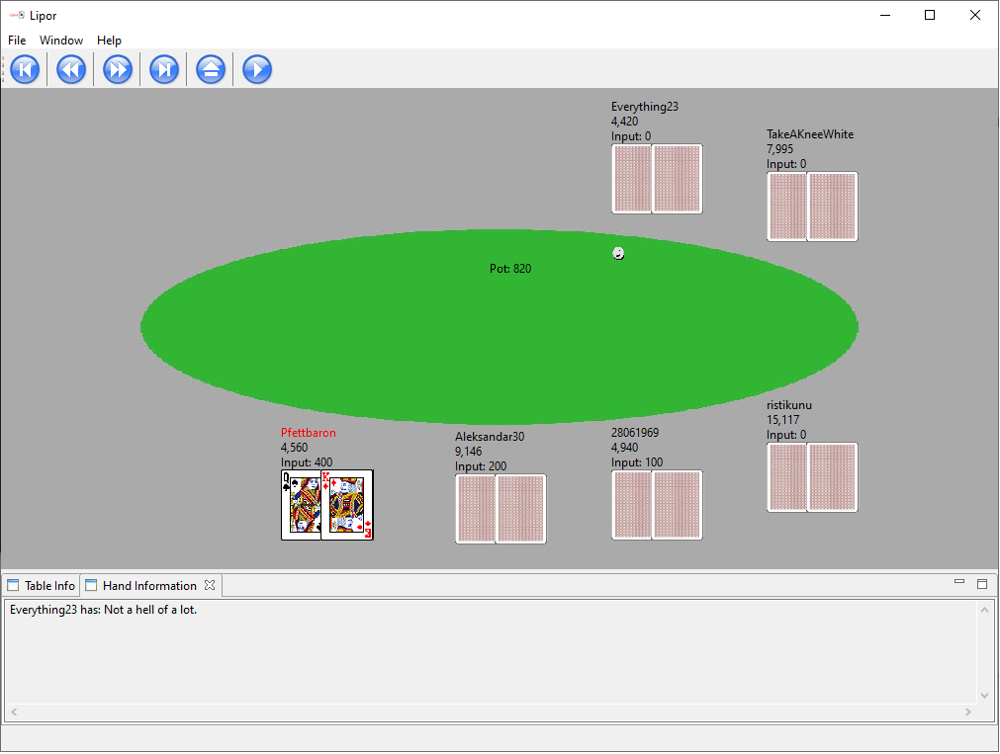

# About
Lipor is a free/libre and open source poker replay app. Currently it only supports win2day. The version of this build is 1.0.0 beta. It has no developers anymore.

# Screenshot

# Download
See https://github.com/andyjh92/lipor

# History
Lipor is the reincarnation of https://sourceforge.net/p/rjpokerreplay/code/, so 98% of Lipor is written by Ralf Joswig. Thank you very much for your work!
Support for win2day was implemented by one guy for his friends. After finishing development his friends found out that PokerTracker can already handle win2day. So this app is probably not in use anymore.

# Licence
Lipor uses the GPLv2 licence.